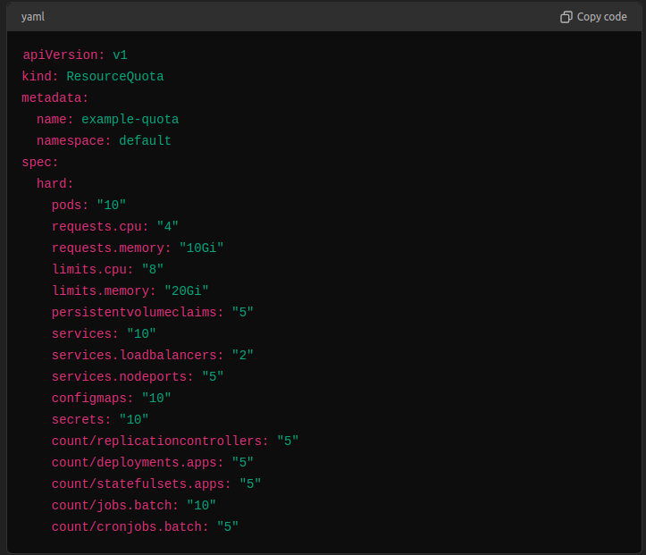

# ResourceQuota no Kubernetes

`ResourceQuota` é um recurso do Kubernetes que permite aos administradores controlar a quantidade total de recursos que podem ser consumidos por todos os objetos em um namespace. Ele ajuda a evitar que um namespace consuma mais do que a sua parte justa dos recursos do cluster, promovendo uma utilização equilibrada dos recursos.

## O que é ResourceQuota?

- **Definição**: `ResourceQuota` é um recurso que impõe limites a recursos agregados, como CPU, memória, número de pods, serviços, volumes persistentes, etc., dentro de um namespace.
- **Objetivo**: Garantir que nenhum namespace consuma uma quantidade desproporcional de recursos do cluster.
- **Escopo**: Aplica-se a todos os objetos dentro de um namespace específico.

## Como Funciona?

Quando um `ResourceQuota` é definido em um namespace, o Kubernetes monitora o uso de recursos dentro desse namespace e impede que novos recursos sejam criados se a quota for excedida. Isso inclui tanto recursos computacionais (como CPU e memória) quanto objetos do Kubernetes (como pods, serviços, volumes, etc.).

## Exemplo de ResourceQuota

Aqui está um exemplo de configuração de um `ResourceQuota`:

## Componentes do Exemplo
- pods: Limita o número total de pods para 10.
- requests.cpu: Limita o total de CPU solicitada para 4 CPUs.
- requests.memory: Limita a memória total solicitada para 10Gi.
- limits.cpu: Limita o total de CPU limitada para 8 CPUs.
- limits.memory: Limita a memória total limitada para 20Gi.
- persistentvolumeclaims: Limita o número de PersistentVolumeClaims para 5.
- services: Limita o número total de serviços para 10.
- services.loadbalancers: Limita o número de serviços de LoadBalancer para 2.
- services.nodeports: Limita o número de serviços NodePort para 5.
- configmaps: Limita o número de ConfigMaps para 10.
- secrets: Limita o número de Secrets para 10.
- count/replicationcontrollers: Limita o número de replication controllers para 5.
- count/deployments.apps: Limita o número de deployments para 5.
- count/statefulsets.apps: Limita o número de statefulsets para 5.
- count/jobs.batch: Limita o número de jobs para 10.
- count/cronjobs.batch: Limita o número de cronjobs para 5.

## Comportamento
- Criação de Recursos: Se uma solicitação para criar um novo recurso (como um pod ou um serviço) exceder qualquer uma das quotas definidas, a solicitação será rejeitada.
- Monitoramento Contínuo: O Kubernetes monitora continuamente o uso de recursos no namespace e atualiza o status do ResourceQuota.
- Relatório de Uso: O status do ResourceQuota inclui informações sobre o uso atual e quanto resta de cada recurso.

## Benefícios do ResourceQuota
- Prevenção de Sobrecarga: Impede que um único namespace consuma todos os recursos do cluster, evitando sobrecarga e promovendo uma utilização equilibrada.
- Isolamento de Recursos: Ajuda a isolar recursos entre diferentes equipes, projetos ou aplicações, garantindo que cada um tenha acesso justo aos
- Gestão de Capacidade: Facilita a gestão de capacidade e planejamento de recursos no cluster, proporcionando uma visão clara do uso de recursos em cada namespace.