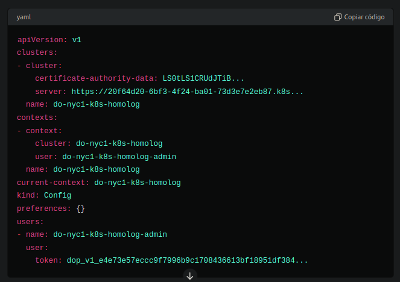
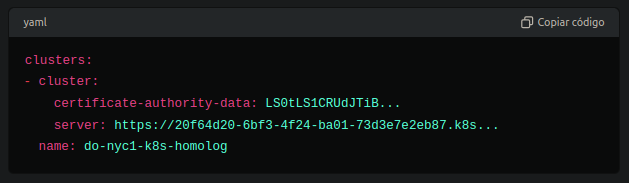
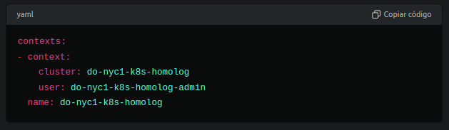
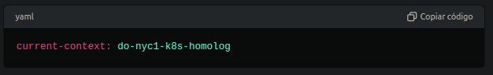
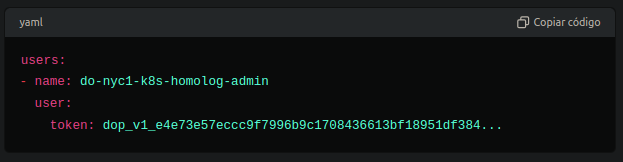

O arquivo kubeconfig é um arquivo de configuração utilizado pelo comando kubectl para interagir com um cluster Kubernetes. Ele contém informações sobre como se conectar ao cluster, incluindo detalhes do servidor API, credenciais de autenticação e contexto de configuração. Vamos detalhar cada parte do seu arquivo kubeconfig.

## Estrutura do arquivo kubeconfig

## Componentes principais do arquivo
**1 - apiVersion: v1**
- Especifica a versão da API do Kubernetes utilizada pelo arquivo de configuração.

**2 - clusters**
- Lista de clusters que podem ser acessados.
- Cada entrada define um cluster e suas configurações, incluindo o servidor API e o certificado de autoridade (CA) usado para validar o servidor.

**3 - contexts**

- Lista de contextos, que combinam um cluster com um usuário.
- Cada contexto permite que você se conecte a um cluster com um conjunto específico de credenciais.

**4 - current-context**

- Define o contexto atualmente em uso.
- Este é o contexto que será utilizado por padrão ao executar comandos kubectl

**5 - kind: Config**
- Especifica o tipo de objeto, neste caso, é um arquivo de configuração.

**6 - preferences**
- Contém configurações preferenciais para kubectl. No seu arquivo, está vazio.

**7 - users**
- Lista de usuários que podem acessar os clusters
- Cada usuário tem um conjunto de credenciais de autenticação, como tokens, certificados de cliente, etc.

## Explicação detalhada dos componentes
clusters:
- name: Nome do cluster, utilizado para referência dentro do arquivo de configuração.
- cluster: Configurações do cluster.
- server: URL do servidor API do Kubernetes.
- certificate-authority-data: Certificado em base64 utilizado para validar o servidor API.

contexts:
- name: Nome do contexto, utilizado para referência.
- context: Configurações do contexto.
  - cluster: Nome do cluster associado a este contexto.
  - user: Nome do usuário associado a este contexto.

current-context:
- Nome do contexto que está sendo utilizado atualmente. Comandos kubectl serão executados utilizando este contexto por padrão.

users:
- name: Nome do usuário, utilizado para referência.
- user: Credenciais do usuário.
  - token: Token de acesso utilizado para autenticação.

# Conclusão

O arquivo kubeconfig é essencial para a autenticação e conexão com clusters Kubernetes. Ele permite que você gerencie múltiplos clusters e usuários, definindo contextos diferentes para cada combinação de cluster e usuário. O exemplo fornecido mostra como definir um cluster, um contexto e um usuário, além de selecionar o contexto atual para uso com kubectl.

