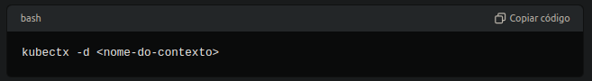

# Gerenciamento de Contextos e Namespaces com kubectx e kubens

## Introdução

Gerenciar múltiplos contextos e namespaces no Kubernetes pode ser uma tarefa desafiadora. As ferramentas `kubectx` e `kubens` facilitam a troca rápida de contextos e namespaces, tornando a administração do seu cluster Kubernetes mais eficiente.

## kubectx

### O que é?

`kubectx` é uma ferramenta de linha de comando que facilita a troca entre diferentes contextos definidos no seu arquivo kubeconfig.

**Trocar de Contexto**
- Para trocar para um contexto específico:

**Trocar para o Contexto Anterior**
- Para alternar para o contexto anteriormente usado:

**Excluir um Contexto**
- Para excluir um contexto (removê-lo do arquivo kubeconfig):

**Renomear um Contexto**
- Para renomear um contexto existente:

## kubens
O que é?
- kubens é uma ferramenta de linha de comando que facilita a troca entre namespaces no Kubernetes.

**Listar Namespaces**
- Para listar todos os namespaces disponíveis no seu cluster:

**Trocar de Namespace**
- Para trocar para um namespace específico:
