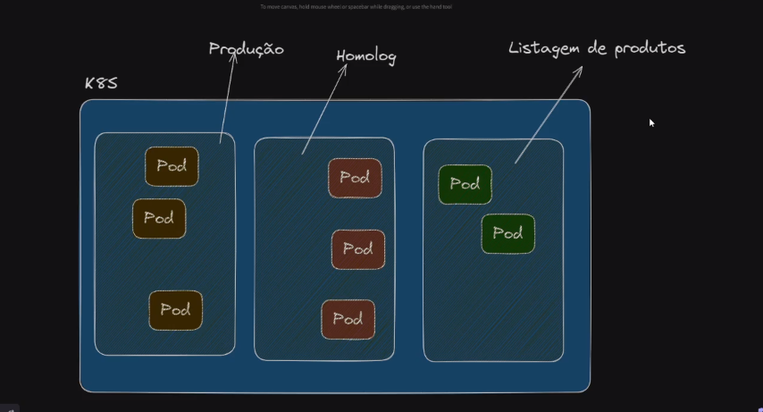

# Gerenciamento de Recursos no Kubernetes

## Introdução

O Kubernetes oferece várias ferramentas para gerenciar e controlar os recursos dentro de um cluster. Estas ferramentas ajudam a garantir que os recursos sejam utilizados de forma eficiente e segura, além de fornecer mecanismos de isolamento e limitação de uso. Este guia aborda os seguintes conceitos:

- Namespaces
- Resources
- Limit Range
- Resource Quota

## Namespaces

### O que são Namespaces?

Namespaces são uma forma de dividir um cluster Kubernetes em ambientes virtuais separados. Eles permitem que você organize e gerencie recursos em um cluster, especialmente útil quando você tem múltiplos projetos ou equipes compartilhando o mesmo cluster.

### Benefícios dos Namespaces

- **Isolamento:** Permitem isolar recursos entre diferentes equipes, projetos ou ambientes (desenvolvimento, teste, produção).
- **Organização:** Ajudam a organizar recursos em categorias lógicas, facilitando a administração.
- **Controle de Acesso:** Permitem aplicar políticas de segurança e controle de acesso específicas para cada Namespace.
- **Quota de Recursos:** Permitem definir quotas de recursos, como CPU e memória, para limitar o uso dentro de um Namespace específico.

## Resources
O que são Resources?
No Kubernetes, Resources (Recursos) referem-se a capacidades computacionais como CPU e memória que são solicitadas por contêineres. Eles são definidos em termos de requests (solicitações) e limits (limites).

Requests: A quantidade mínima de CPU/memória que o contêiner precisa.
Limits: A quantidade máxima de CPU/memória que o contêiner pode usar.

## Limit Range
O que é Limit Range?
Limit Range (Limite de Alcance) é uma política que limita o consumo de recursos (CPU e memória) dentro de um Namespace. Ele define os valores mínimo e máximo que podem ser solicitados ou usados por contêineres e/ou Pods.

## Resource Quota
O que é Resource Quota?
Resource Quota (Quota de Recursos) é uma política que limita o uso total de recursos dentro de um Namespace. Ela garante que um Namespace não consuma mais recursos do que o permitido, ajudando a distribuir de forma justa os recursos do cluster.

## Conclusão
O gerenciamento de recursos no Kubernetes é crucial para garantir a eficiência e a segurança no uso do cluster. Namespaces, Resources, Limit Range e Resource Quota são ferramentas poderosas que permitem controlar e limitar o uso de recursos, proporcionando isolamento e organização dentro do cluster.